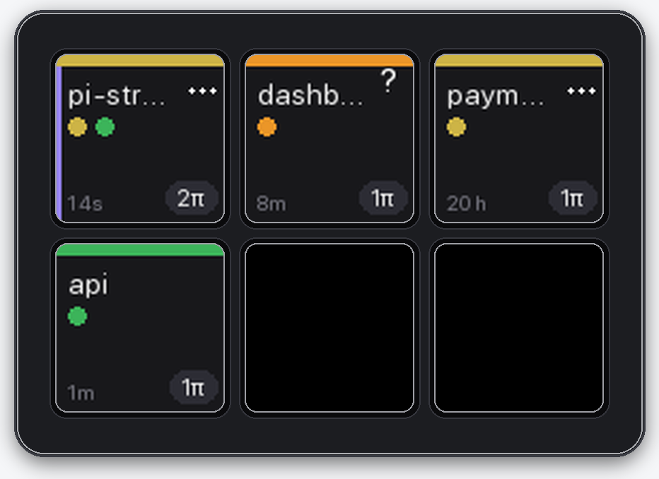
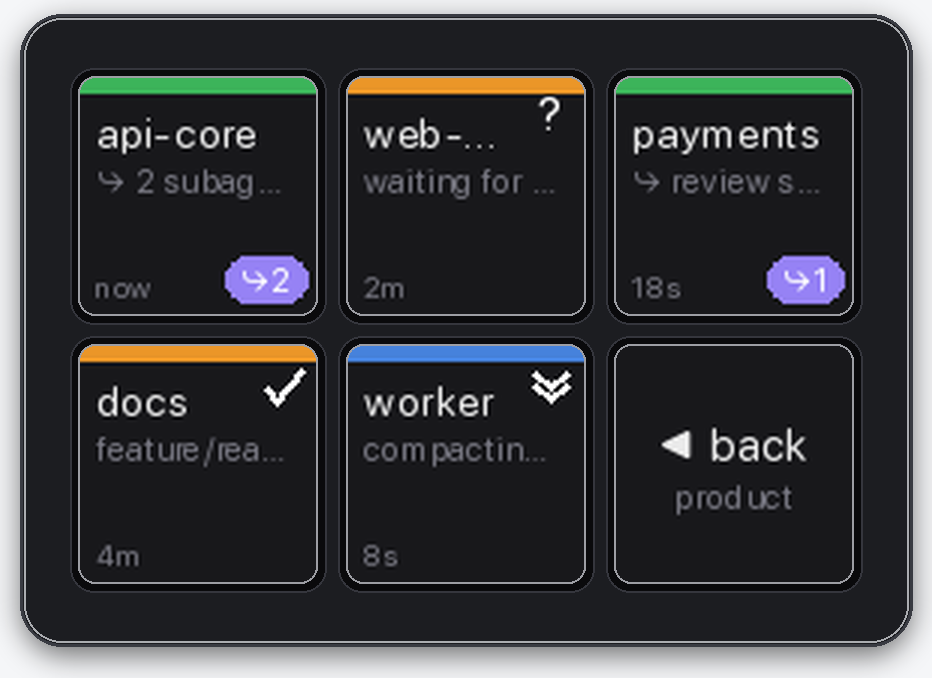

# pi-stream-deck

[](https://github.com/raldred/pi-stream-deck/actions/workflows/test.yml)
[](LICENSE)

Turn an Elgato Stream Deck Mini into a live status board and remote control for
[pi](https://github.com/earendil-works/pi-coding-agent) agents running in
[cmux](https://cmux.com) workspaces.

> The project is named **pi-stream-deck**; its command and local configuration keep the
> shorter `pi-deck` name.

## Preview

<p align="center">
  
  <br>
  <em>Workspace overview</em>
</p>

<p align="center">
  
  <br>
  <em>Agents within a workspace, including active subagents</em>
</p>

## What it does

**Top level: your cmux workspaces.** One key per workspace, in sidebar order, so key
positions match what you already see. Each key shows the workspace title, a coloured band
for the most attention-hungry agent in it, one dot per pi session, an `Nπ` badge, and how
long since anything changed. A pulsing amber/red key means an agent in there is waiting on
you; the pulse gets faster and darker the longer you ignore it.

**Press a workspace → its agents.** One key per pi session in that workspace: repo (or
session name), what it is doing right now (`bash: pytest`), state, and age. The bottom-right
key goes back.

**Press an agent → you are there.** cmux is brought to the front with that workspace
selected and that terminal surface focused.

**Subagents do not get their own key.** A headless `pi -p` child spawned by a session shows
up as small purple dots trailing that workspace's agent dots, and on the agent key as a
purple `⤷N` pill plus a subtitle (`⤷ audit the schema`, or `⤷ 3 subagents`). Only sessions
you can actually sit in front of get a key of their own.

Shortcuts: a workspace with exactly one agent focuses it directly (one press). **Hold** a
workspace key to jump straight to the workspace without drilling in. The agents view
returns to the workspace view on its own after about 25 seconds.

## Colours

| Band | State | Meaning |
|---|---|---|
| 🟢 green | `working` | agent is running — leave it alone |
| 🔵 blue ⇊ | `compacting` | compacting context |
| 🟠 amber ? | `question` | waiting for you to answer a question |
| 🟠 amber ✓ | `waiting` | finished its turn, your move |
| 🟡 gold … | `idle` | alive, but nothing has happened for a while |
| 🔴 red 🔒 | `blocked` | blocked on a permission prompt |
| ⚫️ grey | *(empty)* | cmux workspace with no pi sessions |

## Requirements

- macOS
- An Elgato Stream Deck Mini (the six-key model)
- [pi](https://github.com/earendil-works/pi-coding-agent)
- [cmux](https://cmux.com)
- Python 3
- [Homebrew](https://brew.sh) (the installer uses it to install `hidapi`)

The layout and rendering code assumes six keys. Other Stream Deck models have not yet been
tested.

## Install

```sh
git clone https://github.com/raldred/pi-stream-deck.git
cd pi-stream-deck
scripts/install.sh
```

The installer installs `hidapi` with Homebrew, creates a project-local Python virtual
environment, links the pi extension into `~/.pi/agent/extensions/`, links `pi-deck` into
`~/.local/bin/`, and creates a launch agent so the daemon starts automatically.

To install without the launch agent and run the daemon yourself:

```sh
scripts/install.sh --no-launchd
```

Make sure `~/.local/bin` is on your `PATH`, then check the installation:

```sh
pi-deck doctor    # deck? cmux? any sessions reporting?
pi-deck run -v    # drive the deck in the foreground (if not using launchd)
```

Start a **new** pi session for the extension to load; `/reload` also works in an existing
session. The Stream Deck can only be driven by one app at a time, so quit Elgato's Stream
Deck app (and any other app controlling the device) first.

### Password-protected cmux sockets

If cmux requires `CMUX_SOCKET_PASSWORD`, put only the password in
`~/.pi/agent/pi-stream-deck/cmux-password` before running `scripts/install.sh`:

```sh
mkdir -p ~/.pi/agent/pi-stream-deck
printf '%s' "$CMUX_SOCKET_PASSWORD" > ~/.pi/agent/pi-stream-deck/cmux-password
chmod 600 ~/.pi/agent/pi-stream-deck/cmux-password
scripts/install.sh
```

The generated launch-agent plist is also restricted to your user (`0600`).

## Configuration

Configuration is optional. By default, pi-stream-deck uses a brightness of 60%, shows all
cmux workspaces, focuses single-agent workspaces directly, and returns from the agents view
after 25 seconds.

See the **[configuration guide](docs/configuration.md)** for every setting, file-location
rules, environment variables, password-protected cmux sockets, restarting the daemon, and
troubleshooting.

## Documentation

- **[Configuration](docs/configuration.md)** — settings, data locations, environment
  variables, cmux authentication, and troubleshooting.
- **[How it works](docs/how-it-works.md)** — architecture, session reporting, topology,
  subagents, rendering, and input handling.
- **[Contributing](CONTRIBUTING.md)** — development setup, tests, hardware testing, and pull
  request guidance.

## License

[MIT](LICENSE) © 2026 Rob Aldred
